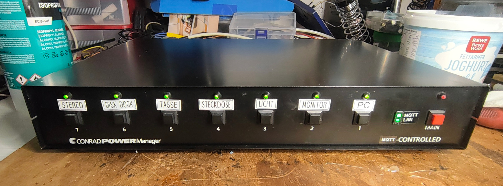
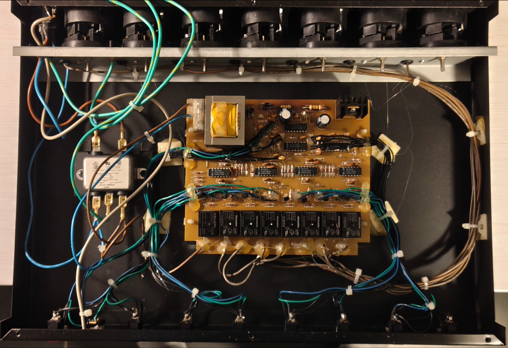
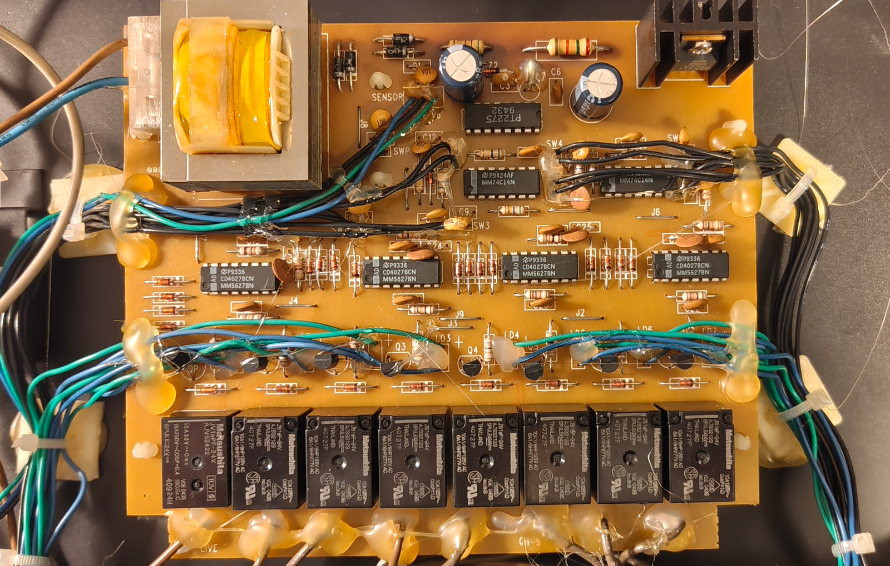
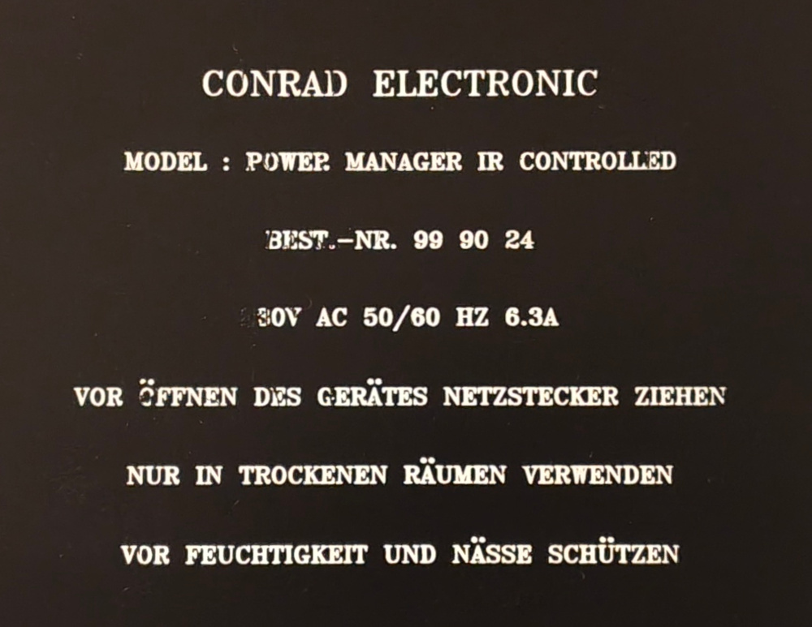
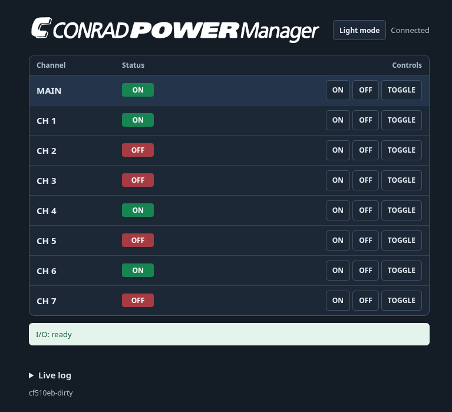

<!-- SPDX-License-Identifier: GPL-3.0-or-later -->


# PowerManager — Retrofit

ESPHome configuration for a WT32-ETH01 running [ESPHome](https://esphome.io/) in a [Conrad](https://www.conrad.de/) PowerManager.

The Conrad PowerManager is a device which controls 7 sockets to power other
devices. On the front there is a MAIN toggle button and one toggle button for each
channel. Each output state is displayed with a corresponding LED on the front.

The original device also had a infrared sensor and a remote control for MAIN and
each channel.




## Device history

The "Conrad PowerManager IR-controlled" was sold from arround 1996 until the early
2000 years.

My device has been in continuous service in this installation for about 30 years now
without any known failure.
This long and trouble-free service life is a strong testament to the quality of the
original device.






## Retro Fit

When I started with Arduino-base microcontroller, I thought about modifying the device.
2026 -- another 10 years later -- I finally did it.

My goal was to preserves the enclosure, LEDs, switches, buttons, sockets and the
operating concept while replacing the control electronics and adding network
integration.

The hope is that the rebuilt Power Manager will continue this record for many more years.

## Hardware Setup

As the ESP32 -- especially in the ethernet variant WT32-ETH has not enaugh GPIO ports
for the LEDs, buttons and relays, I had to use IO-Extenders.
As there are 8 LEDs, 8 buttons and 8 relays, I decided to use 3 IO extenders with 8 IOs each. I found the PCF8574-based boards, which can be daisy-chained. The soldering quality
of the ones I bougth was really poor and I had to correct the soldering that the daisy-chaining worked well.

On every PCF8574 P0 is MAIN and P1 through P7 are CH 1 through CH 7.

The hole in the front of the device where the IR receiver was setup is now used to
mount two LEDs to show the LAN and MQTT status.

| Hardware | Address / GPIO | Configuration / notes |
| --- | --- | --- |
| Button PCF8574 | `0x20`, INT on GPIO35 | Active low, 50 ms debounce; requires an external pull-up to 3.3 V unless one is present on the module |
| Front LED PCF8574 | `0x21` | Active low, current sinking |
| Relay PCF8574 | `0x22` | Active low, verified with the installed board |
| I²C | SDA GPIO33, SCL GPIO32 | Shared bus for all three PCF8574 devices |
| LAN LED | GPIO4 | ON while Ethernet has an IP connection |
| MQTT LED | GPIO14 | ON while connected to the broker; flashes during OTA |

## Relay contact suppression

Each of the eight mechanical relays has an RC snubber connected directly
between COM and NO on the underside of the relay board. This includes MAIN and
CH 1 through CH 7. Every snubber consists of a 47 nF X2 capacitor and a 100 ohm
series resistor.

Without these snubbers, applying 230 V to the switched wiring caused enough
interference to reset output states on the nearby LED and relay PCF8574 devices.
A snubber between NO and neutral did not resolve the fault. A snubber directly
across each affected COM-NO contact did. Suppression is required per contact;
the MAIN snubber does not suppress switching interference from CH 1 through
CH 7.

The contact-parallel circuit creates an OFF-state current path through a
connected load. At 230 V and 50 Hz, 47 nF corresponds to a theoretical maximum
of approximately 3.4 mA per open channel. An open output can therefore show a
voltage on a high-impedance meter, and sensitive loads may glow while switched
off. The snubbers and their insulation must remain suitable for continuous
mains operation.

The installed set passed 20 complete remote test cycles without a PCF8574 read,
write, or output verification error. Each cycle switched MAIN on, switched CH 1
through CH 7 on, and then used MAIN OFF to run the sequential channel shutdown.

- Broker: `fhem.site`, configurable through the YAML substitution.
- OTA: port 3232 with the existing empty bench password.
- During an OTA transfer, the MQTT status LED changes state with the progress
  callback received approximately once per second. After an abort or error, it
  returns to showing the MQTT connection state.
- Time synchronization: SNTP through `ntp.site`, time zone `Europe/Berlin`.
- V1 has no native API, Wi-Fi, timer, or lock function. An MQTT outage does not
  trigger an automatic restart.

## Web interface

After flashing, open `http://powermanager.site/` or `http://<IP-address>/` in a
browser on port 80. MAIN and CH 1 through CH 7 each appear in a compact row:
**Channel | Status | ON · OFF · TOGGLE**. States update live.



During the build, `web/powermanager.js` receives a version generated by
`git describe --tags --always --dirty` and is written to
`web/powermanager.generated.js` for embedding in the firmware. The version is shown in the footer next to a link to the project on GitHub.
The same version is published as a retained value on the MQTT topic
`powermanager/version`. It refers only to this repository. Git does not include
untracked files when deciding whether to append `-dirty`.

The logo in `web/ConradPowerManager.svg` was vectorized from a photo and is
embedded locally through `web/logo.css`. `build.sh` calls
`tools/embed-logo.sh` to update the stylesheet.
The header button switches between light and dark mode. The browser stores the
selection locally; the system preference is used on the first visit.

When the connection is lost, stale states are hidden and controls are disabled.
If an I/O error occurs, OFF actions remain available while ON actions are
disabled. Channel ON actions are also disabled while MAIN is OFF.

All control paths use the same MAIN interlock, including front buttons and
MQTT. An ON command is rejected if any PCF8574 driver reports a failure or
communication error. TOGGLE can then only switch an active output off.
**IO Status** identifies the affected expander by address. If expanders are
missing at startup, all switch states remain OFF.

Driver health is checked internally once per second. **IO Status** is published
to the web interface and MQTT when it changes, plus a heartbeat every ten
minutes.

If an expander is missing during startup, restart the device after reconnecting
it with power removed. The driver does not reinitialize a component that was
marked failed during setup.

The health check is not continuous bus supervision. A disconnected expander
may remain undetected until the next access, and a write failure can still leave
the requested state out of sync because GPIO switches do not return a write
acknowledgement.

The displayed status is the requested relay state. There is no electrical
feedback from the relay contacts.

All web assets are stored on the ESP, so the browser requires no internet
access. The bench interface has no authentication on the local network.
Internal relay switches and physical button sensors remain hidden.

The **Live log** displays ESPHome messages at INFO level and changes to I/O and
channel states. The browser retains at most 500 lines. **Pause** freezes the
display, **Resume** shows the buffered messages, and **Clear** empties it. The
timestamps indicate when the browser received each line. Collection starts
when the page connects; no earlier boot log is available. Logging does not
alter relay or LED control.

The local `components/pcf8574` component overrides the ESPHome driver to provide
diagnostics. Errors contain the operation, I²C address, and error code, for
example `0x21 WRITE failed data=0xFE error=2 (NOT_ACKNOWLEDGED)`. Output writes
are verified after 250 ms. A mismatch sets the warning state and blocks further
ON commands. Successful writes and verification operations are not logged.
Addresses are Buttons `0x20`, Front LEDs `0x21`, and Relays `0x22`.

The interface uses [ESPHome Web Server](https://esphome.io/components/web_server/)
version 3 with a custom `js_include` and no external `js_url`. It calls the
[Web API](https://esphome.io/web-api/) and the existing button actions. An HTTP
success is not treated as confirmation of a new switch state; only events from
the live stream update the display. An additional status request after a
command could otherwise overwrite a newer event with a delayed old response.

## Control behavior and MQTT

MAIN OFF blocks channel activation. The MAIN OFF-to-ON sequence first writes
OFF to every channel without an interval, waits for all relay OFF scripts, and
then activates MAIN. The MAIN ON-to-OFF sequence switches CH 7 through CH 1 off
with the configured interval, then switches MAIN off. Channel states are
unconditionally written OFF in both sequences.

The MAIN front LED stays on throughout the shutdown sequence and turns off only
after the MAIN relay. During startup, the MAIN status and front LED change to ON
only after channel shutdown has completed and the MAIN relay has activated.
This prevents a channel command from entering an active initialization
sequence. Repeating MAIN ON while MAIN is already active does not alter channel
states.

A debounced physical button toggles once per press; holding it does not repeat.
LED and MQTT states represent the requested relay state. There is no electrical
feedback from the relay contacts.

### Remote switching test

`tools/stress-test.py` invokes the same virtual buttons as the web interface and
monitors the live `/events` stream at the same time. It stops on PCF8574 read,
write, or verification errors, an I/O error state, a blocked ON command, or a
state timeout. One cycle switches MAIN on, switches CH 1 through CH 7 on, and
finally switches MAIN off so the sequential all-channel OFF path is exercised.

The test energizes every output. Run it only with a suitable bench setup:

```console
python3 tools/stress-test.py --cycles 20 --confirm-switching
```

The script tests the remote command and complete output path. Physical button
contacts and the PCF8574 interrupt input require a separate manual or electrical
fixture test.

| Topic | Meaning |
| --- | --- |
| `powermanager/0/set` | Control MAIN with `ON`, `OFF`, or `TOGGLE` |
| `powermanager/1/set` … `powermanager/7/set` | Control channels 1 through 7 |
| `powermanager/0/state` … `powermanager/7/state` | Retained `ON` or `OFF` state |
| `powermanager/status` | Availability: `online` or `offline` |
| `powermanager/version` | Retained firmware version generated by `git describe` |

Send commands without the retain flag. Delete retained command messages from
the broker before testing because they could activate loads after a reboot or
reconnect. The firmware itself does not restore previous states.

Example:

```sh
mosquitto_sub -h fhem.site -t 'powermanager/#' -v
mosquitto_pub -h fhem.site -t powermanager/0/set -m ON
mosquitto_pub -h fhem.site -t powermanager/1/set -m ON
mosquitto_pub -h fhem.site -t powermanager/0/set -m OFF
```

## Reset limitation

**V1 does not preserve relay states across an ESP reboot or OTA.** The current
PCF8574 driver rewrites its ports during setup, initially HIGH, and every relay
uses `ALWAYS_OFF`. Powered relays are therefore expected to drop during an ESP
restart even if the PCF8574 remains powered. Preserving these states is an open
requirement for a later implementation.

The ordered MAIN shutdown applies only to normal control logic. Reset, driver
initialization, or an I²C error cannot guarantee that order or even a physically
successful shutdown.

## Build and bench acceptance

```sh
./build.sh --prepare-only
venv/bin/esphome config powermanager.yaml
./build.sh
./build.sh --device powermanager.site
./build.sh --device /dev/ttyUSB0
node tools/web-state.test.cjs
```

Use `build.sh` for compilation so the Git version and embedded assets are
current. With no options it only compiles. With `--device <target>`, it compiles
and then uploads through OTA or the specified serial port. A direct ESPHome
build uses the last generated web bundle.

First test with the low-voltage bench setup powered and without 230 V loads:

1. Start without expanders. **IO Status** must report all three addresses as
   errors, and ON or TOGGLE must not activate MAIN or any channel. Remove power,
   connect the expanders, and restart. The I²C scan must find 0x20, 0x21, and
   0x22; all relays and front LEDs must be OFF.
2. With MAIN OFF, try every channel button and every MQTT channel ON command.
   All channels must remain OFF.
3. Switch MAIN ON; all channels must remain OFF. Switch every channel on and off
   individually and verify that the port number, LED, and MQTT state agree.
4. Activate several channels, then switch MAIN OFF. Verify the channel shutdown
   before MAIN with a logic analyzer. Switch MAIN on again; all channels must
   remain OFF.
5. Repeat MAIN ON while channels are active; their states must remain unchanged.
6. Test ON, OFF, and TOGGLE for MAIN and every channel in the browser, including
   the MAIN interlock and state changes initiated by buttons or MQTT. Press each
   physical button briefly and hold it; each action must cause only one toggle.
7. Disconnect LAN and stop the broker for more than 15 minutes. Local control
   must continue without an automatic restart. Verify status LEDs and MQTT
   states after reconnecting.
8. With channels active, test ESP reset, OTA, and a full power cycle separately
   while recording relay port states. V1 expects OFF after boot. Repeat with
   physical buttons held during startup.
9. Confirm active-low behavior and reliable operation of all eight relays with
   3.3 V logic power and 5 V coil power.

References:
[Ethernet](https://esphome.io/components/ethernet/),
[PCF8574 / INT](https://esphome.io/components/pcf8574/), and
[MQTT](https://esphome.io/components/mqtt/).

## License

This project is licensed under the GNU General Public License, version 3 or
later. See [`LICENSE`](LICENSE) for the complete license text.

The Conrad name and logo are trademarks of their respective owner. They are not
covered by this project's GPL license. The vectorized logo is included solely
to identify and document the original device. This is an independent personal
retrofit project and is not affiliated with, sponsored by, or endorsed by
Conrad Electronic.

## Special Thanks

Special thanks to Conrad Electronic for creating the original PowerManager.
Conrad has been part of my life since childhood and has accompanied my
interest in electronics ever since.
After about 30 years of reliable continuous service, this device has more than
earned the appreciation expressed here. I hope the retrofit does justice to its
quality and keeps it useful for many more years.
